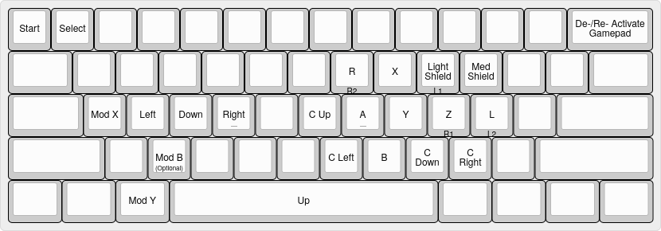

# `th0xx`

Use a keyboard for platform figters on Linux.

Currently using Python scripts using [python-evdev](https://python-evdev.readthedocs.io/en/latest/) to read keyboard inputs and [python-uinput](https://github.com/pyinput/python-uinput) to emit gamepad outputs.

Using the layout:

- The `Mod B` button is only used in scripts ending with `.mod_b.py` and it replaces using the `B` button for extra angles.
- The face legends are for buttons that don't appear on a GCC (for games like Rivals or Ultimate).
